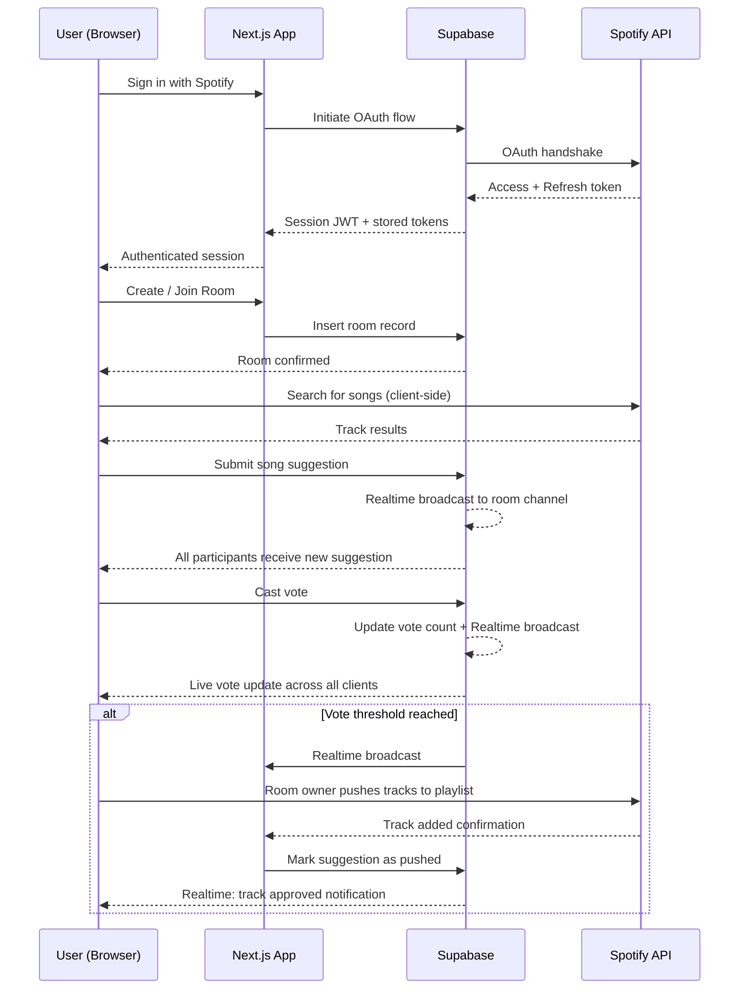

<div align="center">

# 🎵 Collabify

### Democratic music curation for groups - in real time.

[](https://nextjs.org/)
[](https://www.typescriptlang.org/)
[](https://supabase.com/)
[](https://developer.spotify.com/documentation/web-api/)
[](https://vercel.com/)
[](#license)

</div>

---

## Overview

**Collabify** is a real-time collaborative playlist builder that puts music curation in the hands of the whole group. Users create shared rooms, suggest tracks directly from Spotify, vote on submissions, and watch the playlist grow democratically, in real time.

Built on **Next.js**, **TypeScript**, **Supabase**, and the **Spotify Web API**, Collabify is designed around low-latency real-time updates, a clean authentication flow via Spotify OAuth, and a seamless bridge between collaborative voting and Spotify playlist management.

---

## Why Collabify?

Traditional shared playlists (Spotify Collaborative Playlists, Apple Music shared libraries) let anyone add anything - with no structure, no consensus, and no accountability. The result is playlist chaos: duplicate songs, wildly mismatched vibes, and one person dominating the queue.

Collabify solves this with a **democratic vote-to-add model**:

| Problem | Traditional Shared Playlists | Collabify |
|---|---|---|
| Anyone can add anything | ❌ Uncontrolled | ✅ Suggestions go to a vote queue |
| Group consensus | ❌ No mechanism | ✅ Configurable vote threshold |
| Real-time visibility | ❌ Refresh required | ✅ Live updates via Supabase Realtime |
| Fair contribution | ❌ Dominated by one person | ✅ Every participant has equal voting power |

---

## Screenshots

### Homepage


### Dashboard
  

### Voting Room
  

---

## Live Demo

*Live Deployment coming soon via Vercel*

---

## Key Features

- **Spotify OAuth Authentication** - Secure sign-in via Supabase's OAuth provider integration with Spotify.
- **Room Creation & Join by Code** - Hosts generate a shareable room code; participants join instantly using just their Spotify account.
- **Spotify-Powered Song Search** - Suggest tracks directly from the Spotify catalogue using the Web API search endpoint.
- **Real-Time Voting** - All participants see votes update live via Supabase Realtime subscriptions, meaning no polling or page refreshes.
- **Configurable Vote Threshold** - Rooms can define how many votes a song needs before it's approved.
- **Spotify Playlist Push** - Once a track hits the vote threshold, it is added to a 'promoted' queue which the room owner can push to a designated Spotify playlist via the Web API.

---

## How It Works

```
1. User authenticates with Spotify via Supabase OAuth
2. User creates a room (or joins one with a room code)
3. Participants search Spotify and submit song suggestions
4. All participants vote on pending suggestions in real time
5. Room owner pushes promoted songs to Spotify playlist
```

---

## System Architecture & Design

### Authentication Flow

Collabify uses **Supabase Auth with Spotify as the OAuth provider**. On successful authentication, Supabase issues a session JWT and stores the Spotify access/refresh token pair - enabling server-side Spotify API calls on behalf of the authenticated user without exposing tokens to the client unnecessarily.

### Real-Time Collaborative Updates

Real-time functionality is powered by **Supabase Realtime**. When a participant submits a suggestion or casts a vote, the row-level change in Supabase triggers a broadcast to all subscribed clients in that room, ensuring every participant's UI reflects the latest state straight away.

Key real-time channels per room:
- `songs` - new track submissions and voting updates appear instantly for all members
- `room_members` - presence tracking for room members

### Spotify API Integration

- **Search**: used client-side to power the song suggestion input
- **Playlist Management**: called server-side when a track is pushed, using the room owner's stored Spotify access token
- **Token Refresh**: refresh logic runs server-side before any Spotify API call

---

## Architecture Diagram



---

## Tech Stack

| Layer | Technology | Purpose |
|---|---|---|
| **Frontend** | [Next.js 15](https://nextjs.org/) (App Router) | React framework, SSR, Server Actions |
| **Language** | [TypeScript](https://www.typescriptlang.org/) | End-to-end type safety |
| **Backend / DB** | [Supabase](https://supabase.com/) | PostgreSQL database with RLS, Auth, Realtime |
| **Authentication** | Supabase Auth + Spotify OAuth | Secure user authentication |
| **Music API** | [Spotify Web API](https://developer.spotify.com/documentation/web-api/) | Search, track data, playlist management |
| **Deployment (WIP)** | [Vercel](https://vercel.com/) | CI/CD, edge deployment, environment management |
| **Styling** | [Tailwind](https://tailwindcss.com/) | UI styling |

---

## Getting Started

### Prerequisites

- **Node.js** `v18.17+`
- **bun**
- A [Supabase](https://supabase.com/) project (free tier sufficient for development)
- A [Spotify Developer](https://developer.spotify.com/dashboard) application with OAuth credentials

---

### Installation

```bash
# 1. Clone the repository
git clone https://github.com/Vahsek123/collabify.git
cd collabify

# 2. Install dependencies
bun install

# 3. Copy the environment variable template
cp .env.example .env.local
```

---

### Environment Variables

Create a `.env.local` file in the project root. All required variables are listed below:

```env
# Supabase
NEXT_PUBLIC_SUPABASE_URL=your_supabase_project_url
NEXT_PUBLIC_SUPABASE_PUBLISHABLE_KEY=your_supabase_publishable_key
SUPABASE_SERVICE_ROLE_KEY=your_supabase_service_role_key

# Spotify
SPOTIFY_CLIENT_ID=your_spotify_client_id
SPOTIFY_CLIENT_SECRET=your_spotify_client_secret

# App
NEXT_PUBLIC_SITE_URL=http://localhost:3000
```

**Spotify OAuth setup in Supabase:**
1. Navigate to your Supabase project -> **Authentication -> Providers -> Spotify**
2. Enter your `Client ID` and `Client Secret` from the Spotify Developer Dashboard
3. Copy the **Callback URL** shown in Supabase and add it to your Spotify app's Redirect URIs

---

## Running Locally

```bash
# Start the development server
bun run dev
```

Open [http://localhost:3000](http://localhost:3000) in your browser.

```bash
# Linting
bun run lint

# Formatting
bun run format

# Build for production (verify before deploying)
bun run build
```

---

## Roadmap

The following features are planned for future iterations:

- [ ] **Room settings** - configurable vote threshold per room, room expiry, max participants
- [ ] **Playback preview** - 30-second Spotify track preview within the suggestion UI
- [ ] **Mobile app** - React Native client using the same Supabase backend
- [ ] **Multiple playlist providers** - Apple Music and YouTube Music integration

---

## License

*Not currently open source*

---
