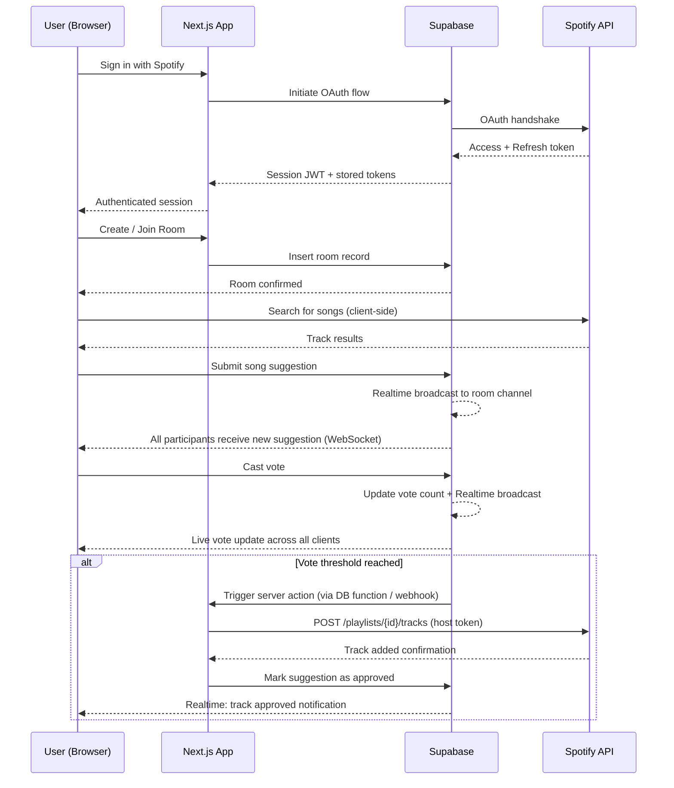

<div align="center">

# 🎵 Collabify

### Democratic music curation for groups — in real time.

[](https://nextjs.org/)
[](https://www.typescriptlang.org/)
[](https://supabase.com/)
[](https://developer.spotify.com/documentation/web-api/)
[](https://vercel.com/)
[](#license)

</div>

---

## Overview

**Collabify** is a real-time collaborative playlist builder that puts music curation in the hands of the whole group. Users create shared rooms, suggest tracks directly from Spotify, vote on submissions, and watch the playlist grow — democratically — in real time.

Built on **Next.js**, **TypeScript**, **Supabase**, and the **Spotify Web API**, Collabify is designed around low-latency real-time updates, a clean authentication flow via Spotify OAuth, and a seamless bridge between collaborative voting and Spotify playlist management.

---

## Why Collabify?

Traditional shared playlists (Spotify Collaborative Playlists, Apple Music shared libraries) let anyone add anything — with no structure, no consensus, and no accountability. The result is playlist chaos: duplicate songs, wildly mismatched vibes, and one person dominating the queue.

Collabify solves this with a **democratic vote-to-add model**:

| Problem | Traditional Shared Playlists | Collabify |
|---|---|---|
| Anyone can add anything | ✅ Uncontrolled | ✅ Suggestions go to a vote queue |
| Group consensus | ❌ No mechanism | ✅ Configurable vote threshold |
| Real-time visibility | ❌ Refresh required | ✅ Live updates via Supabase Realtime |
| Fair contribution | ❌ Dominated by one person | ✅ Every participant has equal voting power |
| Spotify integration | ✅ Native but unstructured | ✅ Approved tracks pushed automatically |

---

## Screenshots

> 📸 **Screenshots and demo GIFs will be added following initial deployment.**

| Room Lobby | Song Suggestions | Voting Queue |
|---|---|---|
| `[screenshot placeholder]` | `[screenshot placeholder]` | `[screenshot placeholder]` |

---

## Live Demo

> 🚀 **Live deployment coming soon.**
>
> `https://collabify.vercel.app` ← *(placeholder — will be updated post-deployment)*

---

## Key Features

- **Spotify OAuth Authentication** — Secure sign-in via Supabase's OAuth provider integration with Spotify. No custom auth logic, no credential storage.
- **Room Creation & Join by Code** — Hosts generate a shareable room code; participants join instantly without needing an account beyond Spotify auth.
- **Spotify-Powered Song Search** — Suggest tracks directly from the Spotify catalogue using the Web API search endpoint.
- **Real-Time Voting** — All participants see votes update live via Supabase Realtime subscriptions — no polling, no page refreshes.
- **Configurable Vote Threshold** — Rooms can define how many votes a song needs before it's approved.
- **Automatic Spotify Playlist Push** — Once a track hits the vote threshold, it is pushed to a designated Spotify playlist via the Web API.
- **Live Participant Presence** — See who's active in the room in real time.
- **Optimistic UI Updates** — Votes and suggestions feel instant before server confirmation.

---

## How It Works

```
1. User authenticates with Spotify via Supabase OAuth
        ↓
2. User creates a room (or joins one with a room code)
        ↓
3. Participants search Spotify and submit song suggestions
        ↓
4. All participants vote on pending suggestions in real time
        ↓
5. When a track reaches the vote threshold → pushed to Spotify playlist
```

---

## System Architecture & Real-Time Design

### Authentication Flow

Collabify uses **Supabase Auth with Spotify as the OAuth provider**. On successful authentication, Supabase issues a session JWT and stores the Spotify access/refresh token pair in the `auth.users` metadata — enabling server-side Spotify API calls on behalf of the authenticated user without exposing tokens to the client unnecessarily.

### Real-Time Collaborative Updates

Real-time functionality is powered by **Supabase Realtime**, which exposes PostgreSQL logical replication as a WebSocket channel. When a participant submits a suggestion or casts a vote, the row-level change in Supabase triggers a broadcast to all subscribed clients in that room — ensuring every participant's UI reflects the latest state within milliseconds.

Key real-time channels per room:
- `suggestions` — new track submissions appear instantly for all participants
- `votes` — vote counts update live as participants interact
- `room_participants` — presence tracking for connected users

### Spotify API Integration

- **Search**: `/v1/search` — used client-side to power the song suggestion input
- **Playlist Management**: `/v1/playlists/{id}/tracks` — called server-side (Next.js API Route / Server Action) when a track is approved, using the room host's stored Spotify access token
- **Token Refresh**: Handled via Supabase's OAuth token storage; refresh logic runs server-side before any Spotify API call

### High-Level Data Flow

```
Client (Next.js)
    │
    ├── Spotify Search → Spotify Web API (client-side, read-only)
    │
    ├── Auth → Supabase Auth (Spotify OAuth provider)
    │
    ├── Room/Vote/Suggestion mutations → Supabase Database (RLS-enforced)
    │
    ├── Real-time subscriptions → Supabase Realtime (WebSocket)
    │
    └── Playlist push → Next.js Server Action → Spotify Web API
                              (uses host's stored OAuth token from Supabase)
```

---

## Architecture Diagram



---

## Tech Stack

| Layer | Technology | Purpose |
|---|---|---|
| **Frontend** | [Next.js 15](https://nextjs.org/) (App Router) | React framework, SSR, Server Actions |
| **Language** | [TypeScript](https://www.typescriptlang.org/) | End-to-end type safety |
| **Backend / DB** | [Supabase](https://supabase.com/) | PostgreSQL database with RLS, Auth, Realtime |
| **Authentication** | Supabase Auth + Spotify OAuth | Secure user authentication |
| **Music API** | [Spotify Web API](https://developer.spotify.com/documentation/web-api/) | Search, track data, playlist management |
| **Deployment** | [Vercel](https://vercel.com/) | CI/CD, edge deployment, environment management |
| **Styling** | *(e.g. Tailwind CSS)* | UI styling |

---

## Project Structure

```
collabify/
├── app/                          # Next.js App Router
│   ├── (auth)/                   # Auth route group
│   │   └── callback/             # Supabase OAuth callback handler
│   ├── room/
│   │   ├── [roomCode]/           # Dynamic room page
│   │   │   └── page.tsx
│   │   └── create/               # Room creation page
│   ├── layout.tsx                # Root layout
│   └── page.tsx                  # Landing / home page
│
├── components/                   # Reusable UI components
│   ├── room/
│   │   ├── SuggestionQueue.tsx   # Live suggestion + vote list
│   │   ├── SearchModal.tsx       # Spotify track search
│   │   ├── VoteButton.tsx        # Vote interaction component
│   │   └── ParticipantList.tsx   # Live presence indicator
│   └── ui/                       # Generic UI primitives
│
├── lib/
│   ├── supabase/
│   │   ├── client.ts             # Browser Supabase client
│   │   ├── server.ts             # Server Supabase client (SSR)
│   │   └── middleware.ts         # Session refresh middleware
│   ├── spotify/
│   │   ├── client.ts             # Spotify API wrapper
│   │   └── types.ts              # Spotify API response types
│   └── utils.ts                  # Shared utility functions
│
├── actions/                      # Next.js Server Actions
│   ├── room.ts                   # Room create / join logic
│   ├── suggestions.ts            # Song suggestion mutations
│   ├── votes.ts                  # Vote casting logic
│   └── playlist.ts               # Spotify playlist push
│
├── types/                        # Global TypeScript types
│   ├── database.ts               # Supabase generated DB types
│   └── index.ts                  # Shared application types
│
├── supabase/
│   └── migrations/               # Database schema migrations
│
├── middleware.ts                  # Next.js middleware (auth session)
├── next.config.ts
├── tsconfig.json
└── .env.local                    # Local environment variables (gitignored)
```

---

## Getting Started

### Prerequisites

- **Node.js** `v18.17+`
- **npm** / **yarn** / **pnpm**
- A [Supabase](https://supabase.com/) project (free tier sufficient for development)
- A [Spotify Developer](https://developer.spotify.com/dashboard) application with OAuth credentials

---

### Installation

```bash
# 1. Clone the repository
git clone https://github.com/YOUR_USERNAME/collabify.git
cd collabify

# 2. Install dependencies
npm install

# 3. Copy the environment variable template
cp .env.example .env.local
```

---

### Environment Variables

Create a `.env.local` file in the project root. All required variables are listed below:

```env
# ─── Supabase ───────────────────────────────────────────────
NEXT_PUBLIC_SUPABASE_URL=your_supabase_project_url
NEXT_PUBLIC_SUPABASE_ANON_KEY=your_supabase_anon_key
SUPABASE_SERVICE_ROLE_KEY=your_supabase_service_role_key

# ─── Spotify OAuth ──────────────────────────────────────────
# Configured as an OAuth provider inside Supabase Auth settings
# Add your Spotify app credentials in the Supabase dashboard:
# Authentication → Providers → Spotify
SPOTIFY_CLIENT_ID=your_spotify_client_id
SPOTIFY_CLIENT_SECRET=your_spotify_client_secret

# ─── App ────────────────────────────────────────────────────
NEXT_PUBLIC_SITE_URL=http://localhost:3000
```

> ⚠️ **Never commit `.env.local` to version control.** The `.gitignore` excludes it by default. The `SUPABASE_SERVICE_ROLE_KEY` must only ever be used server-side.

**Spotify OAuth setup in Supabase:**
1. Navigate to your Supabase project → **Authentication → Providers → Spotify**
2. Enter your `Client ID` and `Client Secret` from the Spotify Developer Dashboard
3. Copy the **Callback URL** shown in Supabase and add it to your Spotify app's Redirect URIs

---

## Running Locally

```bash
# Start the development server
npm run dev
```

Open [http://localhost:3000](http://localhost:3000) in your browser.

```bash
# Type checking
npm run type-check

# Linting
npm run lint

# Build for production (verify before deploying)
npm run build
```

---

## Deployment

Collabify is designed to deploy on **Vercel** with zero configuration beyond environment variables.

### Deploy to Vercel

[](https://vercel.com/new/clone?repository-url=https://github.com/YOUR_USERNAME/collabify)

**Manual deployment steps:**

1. Push the repository to GitHub
2. Import the project in the [Vercel dashboard](https://vercel.com/new)
3. Add all environment variables from `.env.local` into Vercel's **Environment Variables** settings
4. Update `NEXT_PUBLIC_SITE_URL` to your production Vercel URL
5. Add the Vercel production URL as an allowed Redirect URI in your Spotify Developer app settings
6. Deploy

> Vercel automatically handles Next.js App Router, Server Actions, and edge middleware — no additional configuration required.

---

## Roadmap

The following features are planned for future iterations:

- [ ] **Room settings** — configurable vote threshold per room, room expiry, max participants
- [ ] **Queue reordering** — drag-and-drop approved track ordering before Spotify push
- [ ] **Session history** — persist past room sessions and their final playlists
- [ ] **Playback preview** — 30-second Spotify track preview within the suggestion UI
- [ ] **Anonymous participation** — allow non-Spotify users to vote (host-controlled setting)
- [ ] **Mobile app** — React Native client using the same Supabase backend
- [ ] **Multiple playlist providers** — Apple Music and YouTube Music integration

---

## Contributing

Contributions are welcome! Please follow the process below:

1. **Fork** the repository
2. Create a feature branch: `git checkout -b feature/your-feature-name`
3. Commit your changes with clear messages: `git commit -m 'feat: add vote threshold configuration'`
4. Push to your fork: `git push origin feature/your-feature-name`
5. Open a **Pull Request** with a description of your changes and the problem they solve

Please ensure:
- All existing TypeScript types are respected (no `any` without justification)
- `npm run lint` and `npm run type-check` pass before submitting a PR
- New features include a brief description of the approach taken

For significant changes, please open an issue first to discuss the proposed direction.

---

## License

> 📄 **License TBD** — A license will be selected and added prior to public launch.

---

<div align="center">

Built with [Next.js](https://nextjs.org/), [Supabase](https://supabase.com/), and the [Spotify Web API](https://developer.spotify.com/).

</div>
